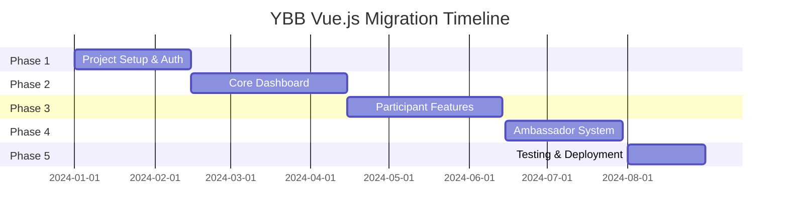

# YBB Platform Migration to Vue.js 3 + Nuxt 3

## 📋 Table of Contents
1. [Overview](#overview)
2. [Prerequisites](#prerequisites)
3. [Migration Strategy](#migration-strategy)
4. [Project Setup](#project-setup)
5. [Architecture Overview](#architecture-overview)
6. [Phase-by-Phase Migration](#phase-by-phase-migration)
7. [Code Examples](#code-examples)
8. [Best Practices](#best-practices)
9. [Team Guidelines](#team-guidelines)
10. [Testing Strategy](#testing-strategy)
11. [Deployment](#deployment)
12. [Troubleshooting](#troubleshooting)

## 🎯 Overview

This document outlines the complete migration strategy from the current CodeIgniter 4 + jQuery/Bootstrap frontend to a modern Vue.js 3 + Nuxt 3 application.

### Why Vue.js?
- **Intern-friendly**: Easiest learning curve for new developers
- **Popular**: 3rd most popular frontend framework globally
- **Productive**: Fast development with excellent tooling
- **Familiar**: Template syntax similar to current PHP views
- **Gradual**: Can be introduced incrementally

### Current vs Target Architecture

**Current:**
```
CodeIgniter 4 (MVC) → Server-side Rendering → jQuery/Bootstrap
```

**Target:**
```
CodeIgniter 4 (API) → Vue.js 3/Nuxt 3 (SPA/SSR) → Modern UI
```

## 🔧 Prerequisites

### Team Skills Required
- **Basic HTML/CSS/JavaScript** (all team members)
- **PHP/CodeIgniter experience** (backend developers)
- **Vue.js basics** (2-week training recommended)

### Development Environment
```bash
# Required software
Node.js v18+ 
npm v9+ or yarn v1.22+
Git
VS Code (recommended)

# Recommended VS Code Extensions
- Vetur or Volar (Vue.js support)
- ESLint
- Prettier
- Auto Rename Tag
- Bracket Pair Colorizer
```

## 📊 Migration Strategy

### Approach: **Gradual Migration**
We'll use a gradual migration approach to minimize risk and allow continuous development.

### Timeline: **6-7 Months Total**



### Migration Phases

| Phase | Duration | Features | Team Focus |
|-------|----------|----------|------------|
| 1 | 6-8 weeks | Setup, Auth, Basic Layout | Senior + 1 intern |
| 2 | 8-10 weeks | Dashboard, Navigation | All team |
| 3 | 8-10 weeks | Participant Management | All team |
| 4 | 6-8 weeks | Ambassador Features | Senior + Mid-level |
| 5 | 4-6 weeks | Testing, Optimization | All team |

## 🚀 Project Setup

### 1. Initialize Vue.js Project

```bash
# Create new Nuxt 3 project
npx nuxi@latest init ybb-frontend
cd ybb-frontend

# Install dependencies
npm install

# Install additional packages
npm install @nuxtjs/tailwindcss @pinia/nuxt @vueuse/nuxt
npm install axios @nuxtjs/proxy
npm install @headlessui/vue @heroicons/vue

# Development dependencies
npm install -D @nuxt/devtools eslint prettier @types/node
```

### 2. Project Structure

```
ybb-frontend/
├── components/           # Reusable Vue components
│   ├── Auth/            # Authentication components
│   ├── Dashboard/       # Dashboard components
│   ├── Forms/           # Form components
│   ├── Layout/          # Layout components
│   └── UI/              # Base UI components
├── pages/               # Route pages (auto-routing)
│   ├── auth/
│   ├── dashboard/
│   ├── participants/
│   └── ambassadors/
├── layouts/             # Layout templates
├── middleware/          # Route middleware
├── plugins/             # Vue plugins
├── composables/         # Reusable composition functions
├── stores/              # Pinia stores (state management)
├── utils/               # Utility functions
├── types/               # TypeScript type definitions
└── assets/              # Static assets
```

### 3. Nuxt Configuration

```typescript
// nuxt.config.ts
export default defineNuxtConfig({
  devtools: { enabled: true },
  
  modules: [
    '@nuxtjs/tailwindcss',
    '@pinia/nuxt',
    '@vueuse/nuxt'
  ],

  css: ['~/assets/css/main.css'],

  runtimeConfig: {
    public: {
      apiBaseUrl: process.env.API_BASE_URL || 'http://localhost:8080/api'
    }
  },

  // API proxy for development
  proxy: {
    '/api': {
      target: 'http://localhost:8080',
      changeOrigin: true
    }
  },

  // SEO and meta
  app: {
    head: {
      title: 'YBB Platform',
      meta: [
        { charset: 'utf-8' },
        { name: 'viewport', content: 'width=device-width, initial-scale=1' }
      ]
    }
  }
})
```

## 🏗️ Architecture Overview

### State Management with Pinia

```typescript
// stores/auth.ts
import { defineStore } from 'pinia'

export const useAuthStore = defineStore('auth', () => {
  const user = ref(null)
  const token = ref(null)
  const isAuthenticated = computed(() => !!user.value)

  const signIn = async (credentials: LoginCredentials) => {
    try {
      const response = await $fetch('/api/auth/sign-in', {
        method: 'POST',
        body: credentials
      })
      
      user.value = response.data.user
      token.value = response.data.token
      
      // Store in localStorage
      localStorage.setItem('auth_token', response.data.token)
      
      return response
    } catch (error) {
      throw error
    }
  }

  const signOut = () => {
    user.value = null
    token.value = null
    localStorage.removeItem('auth_token')
    navigateTo('/auth/sign-in')
  }

  return {
    user: readonly(user),
    token: readonly(token),
    isAuthenticated,
    signIn,
    signOut
  }
})
```

### API Layer

```typescript
// composables/useApi.ts
export const useApi = () => {
  const config = useRuntimeConfig()
  const { token } = useAuthStore()

  const api = $fetch.create({
    baseURL: config.public.apiBaseUrl,
    headers: {
      'Authorization': token ? `Bearer ${token}` : undefined,
      'Content-Type': 'application/json'
    }
  })

  return {
    // Auth endpoints
    auth: {
      signIn: (credentials: LoginCredentials) => 
        api('/auth/sign-in', { method: 'POST', body: credentials }),
      
      signUp: (userData: RegisterData) => 
        api('/auth/sign-up', { method: 'POST', body: userData }),
      
      refresh: () => 
        api('/auth/refresh', { method: 'POST' })
    },

    // Participants endpoints
    participants: {
      getAll: (params?: QueryParams) => 
        api('/participants', { params }),
      
      getById: (id: string) => 
        api(`/participants/${id}`),
      
      create: (data: ParticipantData) => 
        api('/participants', { method: 'POST', body: data }),
      
      update: (id: string, data: Partial<ParticipantData>) => 
        api(`/participants/${id}`, { method: 'PUT', body: data })
    },

    // Ambassadors endpoints
    ambassadors: {
      getAll: (params?: QueryParams) => 
        api('/ambassadors', { params }),
      
      getReferrals: (id: string) => 
        api(`/ambassadors/${id}/referrals`)
    }
  }
}
```

## 📝 Phase-by-Phase Migration

### Phase 1: Project Setup & Authentication (6-8 weeks)

#### Week 1-2: Environment Setup
```bash
# Tasks for Senior Developer
- Set up Nuxt 3 project
- Configure development environment
- Set up CI/CD pipeline
- Create base project structure

# Tasks for Intern
- Learn Vue.js basics (online course)
- Set up local development environment
- Practice with simple components
```

#### Week 3-4: Authentication System

**1. Sign In Component**
```vue
<!-- components/Auth/SignInForm.vue -->
<template>
  <div class="min-h-screen flex items-center justify-center bg-gray-50">
    <div class="max-w-md w-full space-y-8">
      <div>
        <h2 class="text-center text-3xl font-extrabold text-gray-900">
          Sign in to YBB Platform
        </h2>
      </div>
      
      <form @submit.prevent="handleSignIn" class="mt-8 space-y-6">
        <div>
          <label for="email" class="block text-sm font-medium text-gray-700">
            Email Address
          </label>
          <input
            id="email"
            v-model="form.email"
            type="email"
            required
            class="mt-1 block w-full px-3 py-2 border border-gray-300 rounded-md"
            :class="{ 'border-red-500': errors.email }"
          >
          <p v-if="errors.email" class="mt-1 text-sm text-red-600">
            {{ errors.email }}
          </p>
        </div>

        <div>
          <label for="password" class="block text-sm font-medium text-gray-700">
            Password
          </label>
          <input
            id="password"
            v-model="form.password"
            type="password"
            required
            class="mt-1 block w-full px-3 py-2 border border-gray-300 rounded-md"
            :class="{ 'border-red-500': errors.password }"
          >
          <p v-if="errors.password" class="mt-1 text-sm text-red-600">
            {{ errors.password }}
          </p>
        </div>

        <div>
          <button
            type="submit"
            :disabled="loading"
            class="group relative w-full flex justify-center py-2 px-4 border border-transparent text-sm font-medium rounded-md text-white bg-indigo-600 hover:bg-indigo-700 disabled:opacity-50"
          >
            <span v-if="loading">Signing in...</span>
            <span v-else>Sign in</span>
          </button>
        </div>

        <div v-if="error" class="text-center">
          <p class="text-sm text-red-600">{{ error }}</p>
        </div>
      </form>
    </div>
  </div>
</template>

<script setup>
const { signIn } = useAuthStore()
const router = useRouter()

const form = reactive({
  email: '',
  password: ''
})

const errors = reactive({})
const loading = ref(false)
const error = ref('')

const handleSignIn = async () => {
  try {
    loading.value = true
    error.value = ''
    
    // Clear previous errors
    Object.keys(errors).forEach(key => delete errors[key])
    
    // Validate form
    if (!form.email) {
      errors.email = 'Email is required'
      return
    }
    
    if (!form.password) {
      errors.password = 'Password is required'
      return
    }
    
    // Attempt sign in
    await signIn(form)
    
    // Redirect to dashboard
    await router.push('/dashboard')
    
  } catch (err) {
    error.value = err.message || 'Sign in failed. Please try again.'
  } finally {
    loading.value = false
  }
}
</script>
```

**2. Sign Up Component**
```vue
<!-- components/Auth/SignUpForm.vue -->
<template>
  <div class="min-h-screen flex items-center justify-center bg-gray-50">
    <div class="max-w-md w-full space-y-8">
      <div>
        <h2 class="text-center text-3xl font-extrabold text-gray-900">
          Create your account
        </h2>
      </div>
      
      <form @submit.prevent="handleSignUp" class="mt-8 space-y-6">
        <div>
          <label for="fullName" class="block text-sm font-medium text-gray-700">
            Full Name
          </label>
          <input
            id="fullName"
            v-model="form.fullName"
            type="text"
            required
            class="mt-1 block w-full px-3 py-2 border border-gray-300 rounded-md"
          >
        </div>

        <div>
          <label for="email" class="block text-sm font-medium text-gray-700">
            Email Address
          </label>
          <input
            id="email"
            v-model="form.email"
            type="email"
            required
            class="mt-1 block w-full px-3 py-2 border border-gray-300 rounded-md"
          >
        </div>

        <div>
          <label for="password" class="block text-sm font-medium text-gray-700">
            Password
          </label>
          <input
            id="password"
            v-model="form.password"
            type="password"
            required
            class="mt-1 block w-full px-3 py-2 border border-gray-300 rounded-md"
          >
        </div>

        <div>
          <label for="confirmPassword" class="block text-sm font-medium text-gray-700">
            Confirm Password
          </label>
          <input
            id="confirmPassword"
            v-model="form.confirmPassword"
            type="password"
            required
            class="mt-1 block w-full px-3 py-2 border border-gray-300 rounded-md"
          >
        </div>

        <!-- Registration Type Selection -->
        <div v-if="!ambassadorQuery">
          <label class="block text-sm font-medium text-gray-700 mb-2">
            Registration Type
          </label>
          <div class="space-y-2">
            <label class="flex items-center">
              <input
                v-model="form.registrationType"
                type="radio"
                value="self_funded"
                class="mr-2"
              >
              Self Funded
            </label>
            <label class="flex items-center">
              <input
                v-model="form.registrationType"
                type="radio"
                value="fully_funded"
                class="mr-2"
              >
              Fully Funded
            </label>
          </div>
        </div>

        <div>
          <button
            type="submit"
            :disabled="loading"
            class="group relative w-full flex justify-center py-2 px-4 border border-transparent text-sm font-medium rounded-md text-white bg-indigo-600 hover:bg-indigo-700 disabled:opacity-50"
          >
            <span v-if="loading">Creating account...</span>
            <span v-else>Sign up</span>
          </button>
        </div>
      </form>
    </div>
  </div>
</template>

<script setup>
const { register } = useAuthStore()
const router = useRouter()
const route = useRoute()

// Get ambassador query from URL
const ambassadorQuery = computed(() => route.query.q)
const programSlug = computed(() => route.query.program)

const form = reactive({
  fullName: '',
  email: '',
  password: '',
  confirmPassword: '',
  registrationType: 'self_funded'
})

const loading = ref(false)

const handleSignUp = async () => {
  try {
    loading.value = true
    
    // Validate passwords match
    if (form.password !== form.confirmPassword) {
      throw new Error('Passwords do not match')
    }
    
    // Prepare registration data
    const registrationData = {
      full_name: form.fullName,
      email: form.email,
      password: form.password,
      category: form.registrationType
    }
    
    // Add ambassador query if present
    if (ambassadorQuery.value) {
      registrationData.q = ambassadorQuery.value
    }
    
    // Add program if specified
    if (programSlug.value) {
      registrationData.program = programSlug.value
    }
    
    await register(registrationData)
    
    // Redirect to sign in with success message
    await router.push({
      path: '/auth/sign-in',
      query: { message: 'Registration successful! Please sign in.' }
    })
    
  } catch (error) {
    // Handle error (show notification)
    console.error('Registration failed:', error)
  } finally {
    loading.value = false
  }
}
</script>
```

#### Week 5-6: Route Protection & Middleware

```typescript
// middleware/auth.ts
export default defineNuxtRouteMiddleware((to) => {
  const { isAuthenticated } = useAuthStore()
  
  if (!isAuthenticated) {
    return navigateTo('/auth/sign-in')
  }
})
```

```typescript
// middleware/guest.ts
export default defineNuxtRouteMiddleware((to) => {
  const { isAuthenticated } = useAuthStore()
  
  if (isAuthenticated) {
    return navigateTo('/dashboard')
  }
})
```

#### Week 7-8: Basic Layout & Navigation

```vue
<!-- layouts/default.vue -->
<template>
  <div class="min-h-screen bg-gray-50">
    <!-- Navigation -->
    <nav class="bg-white shadow">
      <div class="max-w-7xl mx-auto px-4 sm:px-6 lg:px-8">
        <div class="flex justify-between h-16">
          <div class="flex items-center">
            <NuxtLink to="/dashboard" class="text-xl font-bold text-gray-900">
              YBB Platform
            </NuxtLink>
          </div>
          
          <div class="flex items-center space-x-4">
            <UserDropdown />
          </div>
        </div>
      </div>
    </nav>

    <!-- Sidebar -->
    <div class="flex">
      <Sidebar />
      
      <!-- Main content -->
      <main class="flex-1 p-6">
        <slot />
      </main>
    </div>
  </div>
</template>
```

### Phase 2: Core Dashboard (8-10 weeks)

#### Dashboard Overview
```vue
<!-- pages/dashboard/index.vue -->
<template>
  <div>
    <PageHeader title="Dashboard" />
    
    <!-- Stats Cards -->
    <div class="grid grid-cols-1 md:grid-cols-2 lg:grid-cols-4 gap-6 mb-8">
      <StatCard
        title="Total Participants"
        :value="stats.totalParticipants"
        icon="users"
        trend="+12%"
      />
      <StatCard
        title="Active Programs"
        :value="stats.activePrograms"
        icon="calendar"
      />
      <StatCard
        title="Ambassadors"
        :value="stats.totalAmbassadors"
        icon="user-group"
        trend="+5%"
      />
      <StatCard
        title="Registrations"
        :value="stats.newRegistrations"
        icon="chart-bar"
        trend="+23%"
      />
    </div>

    <!-- Recent Activity -->
    <div class="grid grid-cols-1 lg:grid-cols-2 gap-6">
      <RecentParticipants />
      <UpcomingEvents />
    </div>
  </div>
</template>

<script setup>
definePageMeta({
  middleware: 'auth'
})

const { data: stats } = await useFetch('/api/dashboard/stats')
</script>
```

### Phase 3: Participant Management (8-10 weeks)

```vue
<!-- pages/participants/index.vue -->
<template>
  <div>
    <PageHeader title="Participants">
      <template #actions>
        <NuxtLink
          to="/participants/create"
          class="btn btn-primary"
        >
          Add Participant
        </NuxtLink>
      </template>
    </PageHeader>

    <!-- Filters -->
    <div class="bg-white p-4 rounded-lg shadow mb-6">
      <div class="grid grid-cols-1 md:grid-cols-4 gap-4">
        <div>
          <label class="block text-sm font-medium text-gray-700 mb-1">
            Search
          </label>
          <input
            v-model="filters.search"
            type="text"
            placeholder="Search participants..."
            class="w-full px-3 py-2 border border-gray-300 rounded-md"
          >
        </div>
        
        <div>
          <label class="block text-sm font-medium text-gray-700 mb-1">
            Program
          </label>
          <select v-model="filters.program" class="w-full px-3 py-2 border border-gray-300 rounded-md">
            <option value="">All Programs</option>
            <option v-for="program in programs" :key="program.id" :value="program.id">
              {{ program.name }}
            </option>
          </select>
        </div>
        
        <div>
          <label class="block text-sm font-medium text-gray-700 mb-1">
            Status
          </label>
          <select v-model="filters.status" class="w-full px-3 py-2 border border-gray-300 rounded-md">
            <option value="">All Statuses</option>
            <option value="active">Active</option>
            <option value="pending">Pending</option>
            <option value="inactive">Inactive</option>
          </select>
        </div>
        
        <div class="flex items-end">
          <button
            @click="resetFilters"
            class="px-4 py-2 text-sm text-gray-600 hover:text-gray-800"
          >
            Reset
          </button>
        </div>
      </div>
    </div>

    <!-- Participants Table -->
    <div class="bg-white rounded-lg shadow overflow-hidden">
      <ParticipantsTable
        :participants="participants"
        :loading="loading"
        @edit="editParticipant"
        @delete="deleteParticipant"
      />
      
      <!-- Pagination -->
      <Pagination
        v-if="pagination.totalPages > 1"
        :current-page="pagination.currentPage"
        :total-pages="pagination.totalPages"
        @page-change="changePage"
      />
    </div>
  </div>
</template>

<script setup>
definePageMeta({
  middleware: 'auth'
})

const { data: programs } = await useFetch('/api/programs')

const filters = reactive({
  search: '',
  program: '',
  status: ''
})

const pagination = reactive({
  currentPage: 1,
  totalPages: 1,
  limit: 10
})

const { data: participantsData, loading, refresh } = await useFetch('/api/participants', {
  query: computed(() => ({
    ...filters,
    page: pagination.currentPage,
    limit: pagination.limit
  }))
})

const participants = computed(() => participantsData.value?.data || [])

watchEffect(() => {
  if (participantsData.value?.pagination) {
    Object.assign(pagination, participantsData.value.pagination)
  }
})

const resetFilters = () => {
  Object.assign(filters, {
    search: '',
    program: '',
    status: ''
  })
  pagination.currentPage = 1
}

const changePage = (page) => {
  pagination.currentPage = page
}

const editParticipant = (participant) => {
  navigateTo(`/participants/${participant.id}/edit`)
}

const deleteParticipant = async (participant) => {
  if (confirm('Are you sure you want to delete this participant?')) {
    try {
      await $fetch(`/api/participants/${participant.id}`, {
        method: 'DELETE'
      })
      await refresh()
    } catch (error) {
      console.error('Failed to delete participant:', error)
    }
  }
}
</script>
```

### Phase 4: Ambassador System (6-8 weeks)

```vue
<!-- pages/ambassadors/index.vue -->
<template>
  <div>
    <PageHeader title="Ambassadors">
      <template #actions>
        <button
          @click="generateBulkLinks"
          class="btn btn-secondary mr-2"
        >
          Generate Links
        </button>
        <NuxtLink
          to="/ambassadors/create"
          class="btn btn-primary"
        >
          Add Ambassador
        </NuxtLink>
      </template>
    </PageHeader>

    <!-- Ambassador Cards -->
    <div class="grid grid-cols-1 md:grid-cols-2 lg:grid-cols-3 gap-6">
      <AmbassadorCard
        v-for="ambassador in ambassadors"
        :key="ambassador.id"
        :ambassador="ambassador"
        @view-referrals="viewReferrals"
        @generate-link="generateLink"
      />
    </div>

    <!-- Modals -->
    <ReferralsModal
      v-if="selectedAmbassador"
      :ambassador="selectedAmbassador"
      @close="selectedAmbassador = null"
    />
  </div>
</template>

<script setup>
definePageMeta({
  middleware: 'auth'
})

const { data: ambassadors } = await useFetch('/api/ambassadors')
const selectedAmbassador = ref(null)

const viewReferrals = (ambassador) => {
  selectedAmbassador.value = ambassador
}

const generateLink = async (ambassador) => {
  try {
    const response = await $fetch(`/api/ambassadors/${ambassador.id}/generate-link`)
    
    // Copy to clipboard
    await navigator.clipboard.writeText(response.data.referral_link)
    
    // Show success notification
    // You can use a toast library here
    alert('Link copied to clipboard!')
    
  } catch (error) {
    console.error('Failed to generate link:', error)
  }
}

const generateBulkLinks = async () => {
  // Implementation for bulk link generation
}
</script>
```

## 🧪 Testing Strategy

### Unit Testing
```javascript
// tests/components/Auth/SignInForm.test.js
import { mount } from '@vue/test-utils'
import { describe, it, expect } from 'vitest'
import SignInForm from '~/components/Auth/SignInForm.vue'

describe('SignInForm', () => {
  it('renders correctly', () => {
    const wrapper = mount(SignInForm)
    expect(wrapper.find('h2').text()).toBe('Sign in to YBB Platform')
  })

  it('validates required fields', async () => {
    const wrapper = mount(SignInForm)
    
    // Submit without filling fields
    await wrapper.find('form').trigger('submit.prevent')
    
    expect(wrapper.find('.text-red-600').exists()).toBe(true)
  })

  it('calls signIn when form is valid', async () => {
    const mockSignIn = vi.fn()
    const wrapper = mount(SignInForm, {
      global: {
        mocks: {
          useAuthStore: () => ({ signIn: mockSignIn })
        }
      }
    })

    await wrapper.find('#email').setValue('test@example.com')
    await wrapper.find('#password').setValue('password123')
    await wrapper.find('form').trigger('submit.prevent')

    expect(mockSignIn).toHaveBeenCalledWith({
      email: 'test@example.com',
      password: 'password123'
    })
  })
})
```

### E2E Testing
```javascript
// tests/e2e/auth.spec.js
import { test, expect } from '@playwright/test'

test.describe('Authentication', () => {
  test('user can sign in successfully', async ({ page }) => {
    await page.goto('/auth/sign-in')
    
    await page.fill('#email', 'admin@ybb.com')
    await page.fill('#password', 'password123')
    await page.click('button[type="submit"]')
    
    await expect(page).toHaveURL('/dashboard')
    await expect(page.locator('h1')).toContainText('Dashboard')
  })

  test('shows error for invalid credentials', async ({ page }) => {
    await page.goto('/auth/sign-in')
    
    await page.fill('#email', 'invalid@email.com')
    await page.fill('#password', 'wrongpassword')
    await page.click('button[type="submit"]')
    
    await expect(page.locator('.text-red-600')).toBeVisible()
  })
})
```

## 🎯 Best Practices

### 1. Component Structure
```vue
<template>
  <!-- Template should be clean and readable -->
</template>

<script setup>
// Imports first
import { useAuthStore } from '~/stores/auth'

// Props and emits
const props = defineProps<{
  participant: Participant
}>()

const emit = defineEmits<{
  edit: [participant: Participant]
  delete: [participant: Participant]
}>()

// Composables
const { user } = useAuthStore()
const router = useRouter()

// Reactive data
const loading = ref(false)
const form = reactive({
  name: '',
  email: ''
})

// Computed properties
const canEdit = computed(() => user.value?.role === 'admin')

// Methods
const handleSubmit = async () => {
  // Implementation
}

// Lifecycle hooks
onMounted(() => {
  // Initialization
})
</script>

<style scoped>
/* Component-specific styles */
</style>
```

### 2. API Error Handling
```typescript
// composables/useErrorHandler.ts
export const useErrorHandler = () => {
  const handleApiError = (error: any) => {
    console.error('API Error:', error)
    
    if (error.status === 401) {
      // Redirect to login
      navigateTo('/auth/sign-in')
    } else if (error.status === 403) {
      // Show unauthorized message
      showNotification('You are not authorized to perform this action', 'error')
    } else if (error.status >= 500) {
      // Show server error message
      showNotification('Server error. Please try again later.', 'error')
    } else {
      // Show generic error
      showNotification(error.message || 'An error occurred', 'error')
    }
  }

  return { handleApiError }
}
```

### 3. Form Validation
```typescript
// composables/useFormValidation.ts
export const useFormValidation = () => {
  const validateEmail = (email: string) => {
    const re = /^[^\s@]+@[^\s@]+\.[^\s@]+$/
    return re.test(email) ? null : 'Please enter a valid email address'
  }

  const validateRequired = (value: any) => {
    return value ? null : 'This field is required'
  }

  const validatePassword = (password: string) => {
    if (password.length < 8) {
      return 'Password must be at least 8 characters long'
    }
    return null
  }

  return {
    validateEmail,
    validateRequired,
    validatePassword
  }
}
```

## 👥 Team Guidelines

### For Interns
1. **Start Small**: Begin with simple components like buttons and cards
2. **Follow Examples**: Use existing components as templates
3. **Ask Questions**: Don't hesitate to ask for help
4. **Test Locally**: Always test your changes before pushing
5. **Use Composition API**: Learn the modern Vue.js way

### For Senior Developers
1. **Code Reviews**: Review all intern code before merging
2. **Mentoring**: Provide clear guidance and examples
3. **Architecture**: Make key architectural decisions
4. **Complex Features**: Handle authentication, state management, API integration

### Git Workflow
```bash
# Feature branch workflow
git checkout -b feature/participant-list
git add .
git commit -m "feat: add participant list component"
git push origin feature/participant-list

# Create Pull Request
# After review and approval, merge to main
```

### Code Review Checklist
- [ ] Component follows Vue.js best practices
- [ ] Props and emits are properly typed
- [ ] Error handling is implemented
- [ ] Loading states are handled
- [ ] Accessibility considerations
- [ ] Responsive design
- [ ] Performance optimizations

## 🚀 Deployment

### Production Build
```bash
# Build for production
npm run build

# Preview production build
npm run preview
```

### Environment Configuration
```bash
# .env.production
API_BASE_URL=https://api.ybb.com
NUXT_PUBLIC_API_BASE_URL=https://api.ybb.com
```

### Docker Deployment
```dockerfile
# Dockerfile
FROM node:18-alpine

WORKDIR /app

COPY package*.json ./
RUN npm ci --only=production

COPY . .
RUN npm run build

EXPOSE 3000

CMD ["npm", "start"]
```

## 🐛 Troubleshooting

### Common Issues

#### 1. CORS Errors
```typescript
// Add to nuxt.config.ts
export default defineNuxtConfig({
  proxy: {
    '/api': {
      target: 'http://localhost:8080',
      changeOrigin: true,
      pathRewrite: {
        '^/api': '/api'
      }
    }
  }
})
```

#### 2. State Not Persisting
```typescript
// stores/auth.ts - Add persistence
export const useAuthStore = defineStore('auth', () => {
  // ... store logic

  // Hydrate from localStorage on client
  if (process.client) {
    const savedToken = localStorage.getItem('auth_token')
    if (savedToken) {
      token.value = savedToken
      // Validate token and get user data
    }
  }
})
```

#### 3. Route Protection Not Working
```typescript
// middleware/auth.ts
export default defineNuxtRouteMiddleware((to) => {
  // Ensure this runs on client side
  if (process.server) return

  const { isAuthenticated } = useAuthStore()
  
  if (!isAuthenticated) {
    return navigateTo('/auth/sign-in')
  }
})
```

## 📚 Resources

### Learning Materials
- [Vue.js Official Documentation](https://vuejs.org/guide/)
- [Nuxt 3 Documentation](https://nuxt.com/docs)
- [Pinia Documentation](https://pinia.vuejs.org/)
- [Vue.js Course for Beginners](https://www.vuemastery.com/)

### Tools and Extensions
- **VS Code Extensions**: Volar, ESLint, Prettier
- **Browser Extensions**: Vue.js Devtools
- **Testing**: Vitest, Playwright
- **UI Libraries**: Headless UI, Heroicons

### Community
- [Vue.js Discord](https://discord.com/invite/vue)
- [Nuxt Discord](https://discord.com/invite/ps2h6QT)
- [Stack Overflow](https://stackoverflow.com/questions/tagged/vue.js)

---

## 📊 Migration Checklist

### Phase 1: Setup & Auth ✅
- [ ] Project initialization
- [ ] Development environment setup
- [ ] Authentication system
- [ ] Route protection
- [ ] Basic layout

### Phase 2: Core Dashboard
- [ ] Dashboard overview
- [ ] Navigation system
- [ ] User management
- [ ] Settings pages

### Phase 3: Participant Management
- [ ] Participant list
- [ ] Participant forms
- [ ] Search and filtering
- [ ] Bulk operations

### Phase 4: Ambassador System
- [ ] Ambassador management
- [ ] Referral tracking
- [ ] Link generation
- [ ] Analytics

### Phase 5: Testing & Deployment
- [ ] Unit tests
- [ ] E2E tests
- [ ] Performance optimization
- [ ] Production deployment

---

**Next Steps**: Review this documentation with your team and start with Phase 1 setup. Each phase includes detailed implementation guides and can be assigned to different team members based on their skill level.